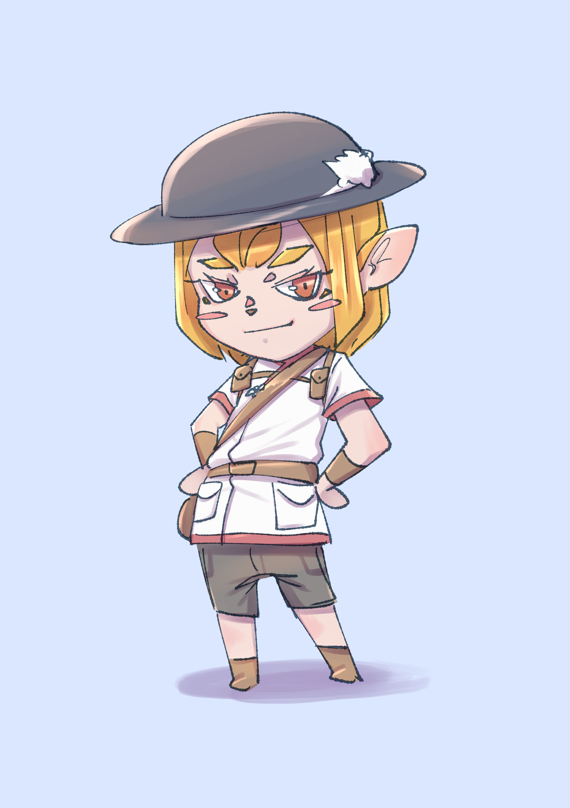
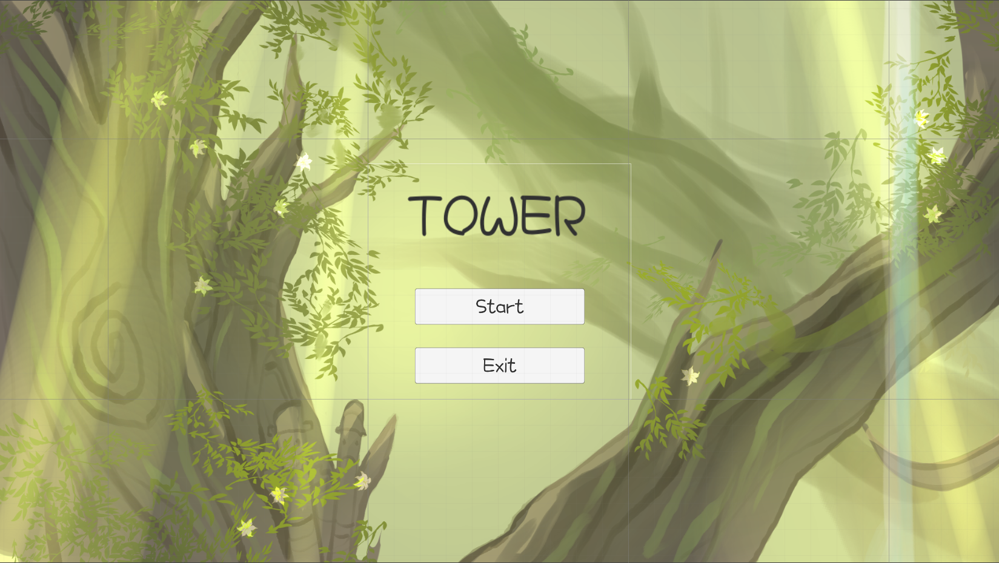
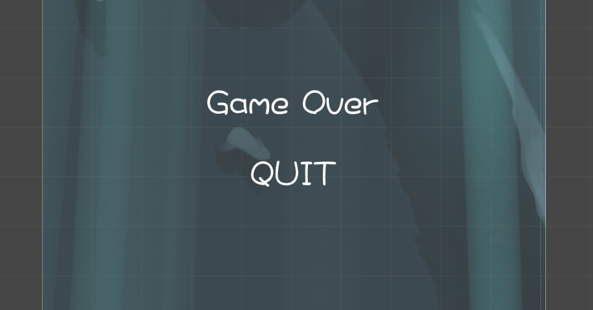

[목차]

[1.게임명 : Tower ](#게임명)

[2.컨셉](#컨셉)

[3.관련 이미지](#관련-이미지)

[4.대표 이미지](#대표-이미지)

[5.구성요소](#구성-요소)

[6.개발 요구사항](#개발-요구사항)

[7.현재 개발된 게임 실행 모습](#현재-개발된-게임-실행-모습)

 

# [게임명]

# Tower

# [컨셉]

## 메인컨셉 
- 2D플렛폼 게임
- 점프만으로 타워를 오르며 정상에 도달하는 게임이다
- 점프킹과 유사한 게임으로 점프의 방식과 난이도를 반영했다.
- 매마른 땅의 배경부터 초목이 풍성한 배경까지 이쁜 배경들로 인해 몰입감을 높혔다.

  
# [관련 이미지]
- 점프킹

  
# [대표 이미지]

  

## [구성 요소]

[도전 과제]
- 점프를 통해 타워를 오르며 퍼즐을 풀고 타워의 끝에 다다르는 게임이다.

[재미 요소]
- 한번 실수하면 밑으로 크게 떨어진다는 긴장감과 여려운 난이도로 안한
- 클리어 했을 때의 성취감이 크다.

[카메라]  
- 2D플렛폼 게임으로 마리오와 같은 시점의 게임이다.

[스토리]
- 모험가인 주인공이 여행을 하다 타워에 들어오게 되고
- 밖으로 나가기 위해선 타워의 정상에 올라야 한다.

[디자인과 색체]
- 위로 올라가면서 점점 초목이 푸르러 지는 이쁜 디자인이다

[음향]  
- 긴장감을 줄 수 있는 음악으로 몰입감을 더했다.

[제작툴] 
- 유니티 엔진

# [게임 시스템 디자인]

## 1.플레이어

- 좌, 우 방향키로 이동을 하고 space바를 눌러 점프를 한다
- 점프는 누르는 시간에 따라 점점 강해지고 점프의 최대치는 정해져 있다

## 2.로비화면

- 최상단에 게임 타이틀이 적혀 있다
- 게임을 시작하느 Start 버튼이 있다. 
- 게임을 종료하는 Quit 버튼이 있다.

## 3.필드화면

- 좌측 상단에 시간이 표시 된다
- 몆몆 층마다 시간을 늘려주는 포인트가 있다.
- 막혀있는 갈을 열어줄 레버가 있다.
- 2스테이지 부터 점차 올라가면서 빛이 줄어드는 연출이 있다.
- ESC 버튼을 누르면 일시정지가 되며
- Continue 버튼과 Quit 버튼이 있다.

## 4.종료화면

- 최상단에 GAME OVER 문구가 있다.
- 게임을 종료하는 Quit 버튼이 있다.

 

## 6. 게임의 규칙

- 플레이어는 정해진 시간 안에 탑을 올라야 한다.
- 시간을 늘려주는 포인트를 먹으면 그만큼 시간이 추가가 된다.
- 최상층까지 오르게 되면 게임은 종료된다
- 시간이 다 지나가면 게임종료 화면으로 바뀐다

 

# [개발 요구사항]

1. 점프킹과 유사한 점프 시스템 구현
2. 플레이어가 서 있을 수 있는 바닥과 튕겨져 나오는 벽 구현
3. 퍼즐 형태의 기믹 추가
4. 난이도 있는 발판 배치
5. 점차 올라갈 수록 광원의 세기 증가
6. 올라갈 수록 화면이 어두워 지는 효과
7. 배경음악과 효과음
8. 시간이 줄어들고 아이템을 먹으면 증가하는 효과

 

# [현재 개발된 부분]
## 1. 개발된 부분

1. 메인 화면에서 게임화면으로 넘어가고 게임이 종료될 시 종료 화면으로 넘어가는 기능
2. 플레이어의 조작 완성
3. 전반적인 맵의 기믹과 난이도 설정
4. 빛의 효과
5. ESC를 눌렀을 때 나오는 메뉴화면
6. 시간이 흐르고 0이 되면 게임이 종료하는 기능
7. 게임 종료 화면

## 2. 추가되어야 하는 부분

1. 새 형태의 몬스터 추가
 - 밑에서 부딧히면 게임 오버가 되고 위에서 밟으면 발판으로 사용 가능한 형태
2. 게임 종료후 남은 시간으로 랭킹을 정하는 시스템

# [현재 개발된 게임 실행 모습]

