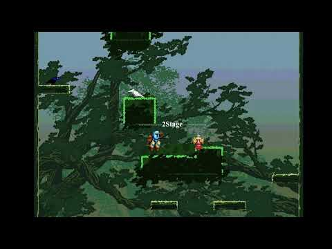
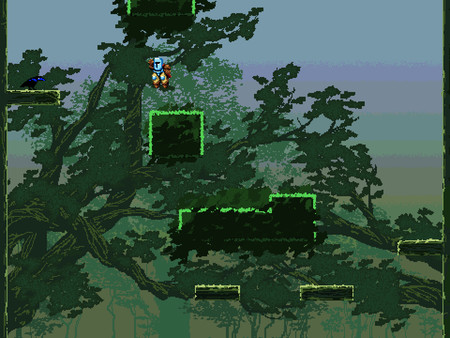
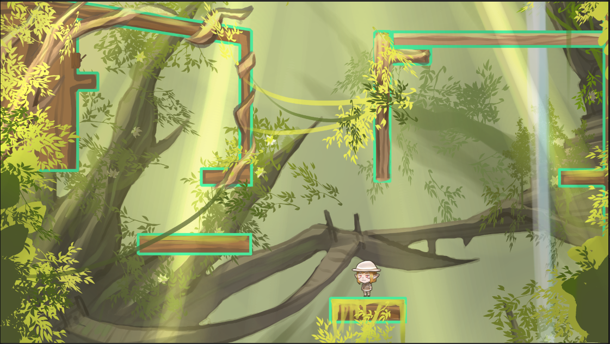
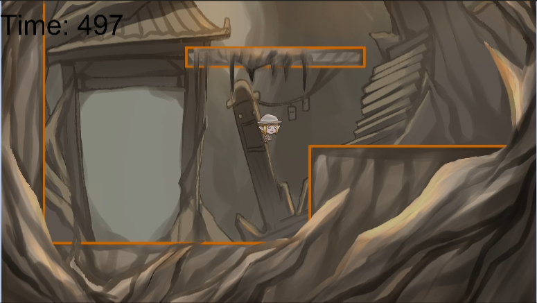
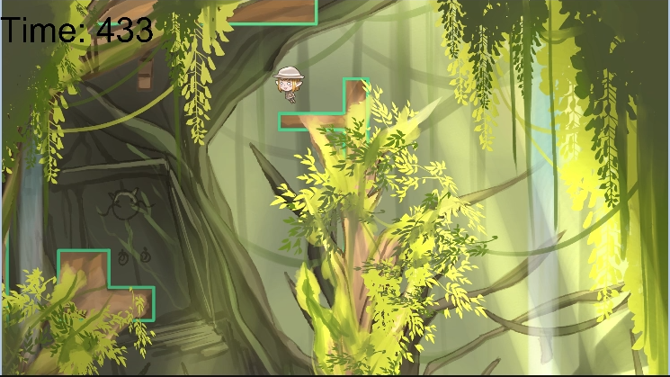
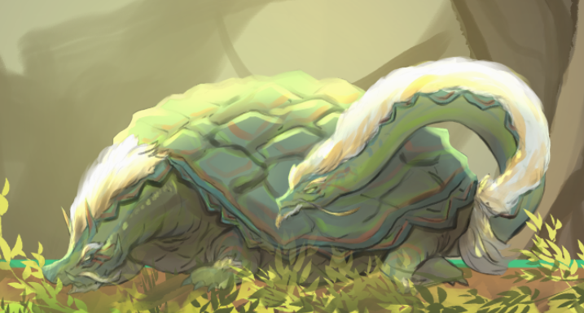
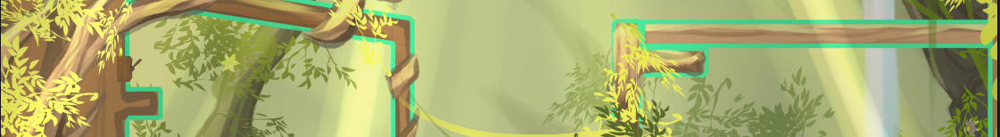

# [게임명 Tower]

## [목차]

[1.컨셉](#컨셉)

[2.관련 이미지](#관련-이미지)

[3.대표 이미지](#대표-이미지)

[4.작품 묘사](#작품-묘사)

[5.구성 요소](#구성-요소)

[6.게임 시스템 디자인](#게임-시스템-디자인)

[7.6주 개발 요구사항](#6주-개발-요구사항)

[8.1년 개발 요구사항](#1년-개발-요구사항)

 

# [컨셉]

## 메인컨셉 : 탑
- 플레이어는 탑을 올라 정상에 도달하는 게임이다.

## 서브컨셉 1 : 사방신
- 탑의 각 층은 탑의 수호신이 지키고 있고 각 층마다 다른 배경을 가지고 있다.

## 서브컨셉 2 : 점프
- 2D플레폼 게임에서 점프는 중요한 역할을 한다.
- 점프의 파워조절과 점프시 방향전환을 못하는 점프 시스템을 가지고 있다.

## 서브컨셉 3 : 난이도
- 어려운 난이도를 자랑하는 게임이다
- 작은 발판들을 밟고 올라가는 게임이기에 어려운 난이도를 자랑한다.

## 서브컨셉 4 : 이쁜 그래픽
- 각 층의 컨셉의 맞게 이쁜 그래픽을 자랑하는 게임이다.

## 서브컨셉 5 : 퍼즐
- 각 층마다 위로 올라 가지 못하도록 막아놓은 구간이 있고
- 이 구간을 해결할 수 있는 기믹을 준비해 놓았다.

  
## [관련 이미지]
- 점프킹

  
## [대표 이미지]

  

## [작품 묘사]
- 플레이어는 방향 조작키인 A와 D를 이용하여 좌우로 이동하고
- 스페이스 바 키를 눌러 점프를 하게 된다.
- 점프는 스페이스 바를 누르는 시간마다 그 힘이 증가하고 최대로 뛸 수 있는 한계가 있다.
- 탑을 오르며 탑에 걸려있는 퍼즐을 풀고 위로 올라가게 된다.

## [구성 요소]

[도전 과제]
- 점프를 통해 타워를 오르며 퍼즐을 풀고 타워의 끝에 다다르는 게임이다.

[재미 요소]
- 한번 실수하면 밑으로 크게 떨어진다는 긴장감과 여려운 난이도로 안한
- 클리어 했을 때의 성취감이 크다.

[카메라]  
- 2D플렛폼 게임으로 마리오와 같은 시점의 게임이다.

[스토리]
- 모험가인 주인공이 여행을 하다 타워에 들어오게 되고
- 밖으로 나가기 위해선 타워의 정상에 올라야 한다.

[디자인과 색체]
- 위로 올라가면서 점점 초목이 푸르러 지는 이쁜 디자인이다

# [게임 시스템 디자인]

## 게임 오브젝트 분해(구성 요소 분석)
|번호|오브젝트이름(영문)|이미지|
|------|---|---|
|1|Player||
|2|NPC1||
|3|Puzzle||

## 파라미터(속성) 뽑아보기
### 1. 오브젝트 이름 : 플레이어
|속성|영문 명칭|설명|
|------|---|---|
|움직임 속도|speed|플레이어가 좌우로 움직이는 속도, 고정값|
|점프 파워|jump power|플레이어가 점프 할 때의 힘, 조절이 가능함|

### 2. 오브젝트 이름 : 현무
|행동|영문 명칭|설명|
|------|---|---|
|충돌 확인|Npc_trigger|플레이어와의 충돌을 감지함|

### 3. 오브젝트 이름 : 퍼즐
|행동|영문 명칭|설명|
|------|---|---|
|충돌 확인|puzlle_trigger|플레이어와의 충돌을 감지함|

## 행동 뽑아 보기
### 1. 오브젝트 이름 : 플레이어
|행동|영문 명칭|설명|
|------|---|---|
|왼쪽으로 이동|move_a|'A'키를 누르고 있을 때 플레이어가 왼쪽으로 이동함|
|오른쪽으로 이동|move_d|'D'키를 누르고 있을 때 플레이어가 오른쪽으로 이동함|
|점프준비|jump_reddy|스페이스 바 키를 누르고 있을 때 플레이어가 점프하기 전 힘을 모으는 자세를 취함|
|점프|jump_stance|스페이스 바 키를 땠을 때 저장된 힘 만큼 점프함|

### 2. 오브젝트 이름 : 현무
|행동|영문 명칭|설명|
|------|---|---|
|충돌|Npc_trigger_on|플레이어와의 충돌을 하고 있을 때 NPC 대사 출력|

### 3. 오브젝트 이름 : 퍼즐
|행동|영문 명칭|설명|
|------|---|---|
|충돌|puzzle_trigger_on|플레이어와 충돌을 감지하면 막혔던 벽이 사라짐|

## 게임 규칙

### 1.플레이어

- 좌, 우 방향키로 이동을 하고 스페이스 바를 눌렀다 때면 점프를 한다
- 점프는 누르는 시간에 따라 점점 강해지고 점프의 최대치는 정해져 있다

### 2.로비화면

- 최상단에 게임 타이틀이 적혀 있다
- 게임을 시작하느 Start 버튼이 있다. 
- 게임을 종료하는 Quit 버튼이 있다.

### 3.필드화면

- 좌측 상단에 시간이 표시 된다
- 몆몆 층마다 시간을 늘려주는 포인트가 있다.
- 막혀있는 갈을 열어줄 레버가 있다.
- 2스테이지 부터 점차 올라가면서 빛이 줄어드는 연출이 있다.
- ESC 버튼을 누르면 일시정지가 되며
- Continue 버튼과 Quit 버튼이 있다.

### 4.종료화면

- 최상단에 GAME OVER 문구가 있다.
- 게임을 종료하는 Quit 버튼이 있다.

### 5. 클리어 or 앤딩 조건

- 플레이어는 정해진 시간 안에 탑을 올라야 한다.
- 시간을 늘려주는 포인트를 먹으면 그만큼 시간이 추가가 된다.
- 최상층까지 오르게 되면 게임은 종료된다
- 시간이 다 지나가면 게임종료 화면으로 바뀐다

 

# [6주 개발 요구사항]

## 플레이어 및 게임 시스템
1. 게임 시작시 메인 화면 제작
- 중앙 상단에 타이틀인 Tower출력
- 타이틀 밑에 Start, Quit 버튼 제작
- Start 버튼 클릭시 게임으로 이동
- Quit 버튼 클릭시 게임을 종료

2. 플레이어 움직임 제작
- A 를 누를 시 왼쪽으로 이동
- D 를 누를 시 오른쪽으로 이동
- 스페이스 바를 누르고 있을 때 점프 준비 모션
- 스페이스 바를 땠을 때 점프
- 점프 도중에 방향전환 불가능
- 점프 도중 벽과 충돌하면 튕겨져 나옴

3. 맵 제작
- 플레이어가 설 수 있는 땅과 미끄러 지는 벽으로 클라이더를 나눔
- 카메라는 플레이어가 잇는 층이 바뀔 때 마다 플레이어를 따라감
- 1스테이지 현무의 방 컨셉을 기본으로 둠
- 물이 없어 식물들이 자라지 못하는 삭막한 땅 부터 시작
- 3층에 현무를 두고 플레이어와 상호작용 기능을 만듬
- 층을 올라 갈 수록 점점 풀과 나무가 많아짐
- 층을 올라 갈 수록 점점 난이도가 올라감
- 층을 올라 갈 수록 광원에 의한 빛이 점점 강해짐
- 1스테이지 중간 부분에 트리거를 건들면 땅을 생성
- 1스테이지 마지막 부분에 막힌 벽을 제작
- 1스테이지 마지막 부분에 레버를 설치하여 막힌 벽을 제거
 

# [1년 개발 요구사항]

## 추가사항

## 플레이어 및 게임 시스템
1. 게임 시작시 메인 화면 제작
- 앤딩 or 게임 종료 화면 제작
- Option 버튼 클릭시 음량 조절 기능 제작
- 잔잔함 BGM출력

2. 플레이어 움직임 제작
- 플레이어가 점프하고 내려올 때 간혈적으로 바닥에 들어갔다가 나오는 현상 해결

3. 2스테이지 제작
- 2스테이지는 청룡이 있는 스테이지로 푸른 빛이 도는 맵
- 하지만 청룡이 빛을 없에버려서 층을 오를수록 화면이 어두워짐
- 최종적으로 캐릭터 바로 주위를 제외한 나머지 부분은 검은 화면이 됨
- 2스테이지 마지막 부분에서 점프 퍼즐을 제작
- 빛이 사라진 어두운 곳에서 밟을 수 있는 발판만으로 정상에 도달
- 매우 어려운 난이도로 제작
- 마지막에 청룡의 방으로 도착하면 청룡의 대사 출력

4. UI
- 게임중 ESC키를 누르면 Option 창이 뜸
- Option 창에선 계속하기, 저장하기, 종료하기 기능 구현
- 타이머를 제작해 좌측 상단에 플레이 시작을 측정
- 각 층에 도달할 때 마다 클리어 시간을 기록하고 출력함
